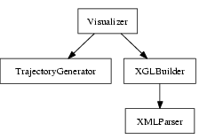
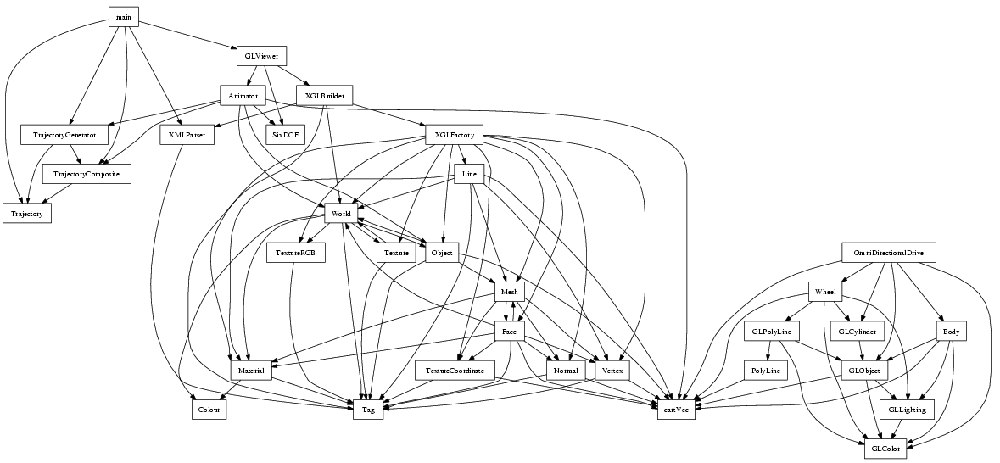
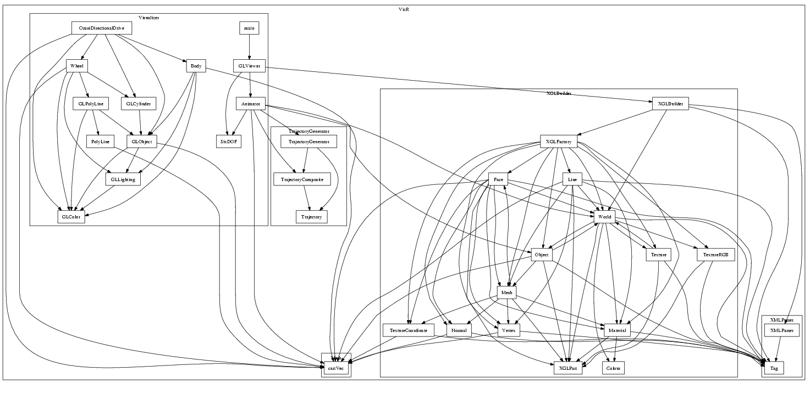
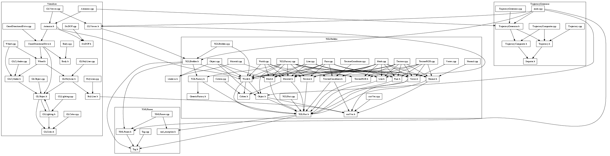

# Nmdepend - "all in 1" project page


[Project page](https://web.archive.org/web/20050314220155/http://sourceforge.net/projects/nmdepend/)

Most reverse engineering tools use source code as input. Nmdepend uses binary object files instead. In other words source code analyzers operate on compiler level and Nmdepend operates on linker level.

The idea came from a someone who used the build system of a project to force the linker to produce link errors. These link errors were used to find dependencies between libraries.

The prototype of Nmdepend was a two-hour perl hack, which used the nm command to read the object files and produce a UML package diagram with help of Graphviz. Now we are redesigning it using C++.

Source code analyzers need information from the build system or the preprocessor output. This requires a good integration with the build system, which is not always easy. Nmdepend tries to act the same way as a linker which should ease integration into a build system.

## Code vs. Model centric

The latest fashion pushed by OMG is model centric development. This means the model is sacred and code and documentation should be generated from the model. On the other side there is code centric development, where the code is sacred and (design) documentation should be generated from the code. It’s not really a matter of choice and we probably need both.

## Code architecture

Developers usually organize their files in directories. The build system has knowledge about the cross directory dependencies. This is the link between the tree structure of the file organization and the graph structure of the software product. Also it is common to group object files in libraries. Libraries, which are not deliverables of a project, are referred to as convenience libraries.

This natural organization of files and directories should be consistent with C++ classes and namespaces as well as UML packages or generated libraries and executables. Conventions like “one class per file” can help to achieve this. Nesting classes is a way to hide details. If a layered architecture is chosen then this should be reflected in the file organization.

The directory names and the tree structure can be used as meta information and compared with information from a design specification (e.g., model).

## Nmdepend functionality

- Create a diagram of cross package dependencies.
- Create a class dependency diagram of a group of files.
- Check package/class access violations to a design specification.

### Example

The images and .dot files linked behind them are generated using Nmdepend on a project which implements an interactive simulation/visualisation environment based on [XGL](https://web.archive.org/web/20050314220155/http://www.xglspec.org/).




### New features

Packages displayed in the object diagram:



Include graph:



### Building this software

Since this project is still in early development stage the only way to obtain this software is to get it from CVS.

```bash
cvs -d:pserver:anonymous@cvs.sourceforge.net:/cvsroot/nmdepend login
cvs -z3 -d:pserver:anonymous@cvs.sourceforge.net:/cvsroot/nmdepend co nmdepend

cmake .
make
make install
```

## FAQ

**Q: Why the name 'Nmdepend'?**  
A: nm as in GNU Binutils and depend as in dependency.

**Q: How should 'Nmdepend' be pronounced?**  
A: Neither like eminem nor mnemonic, but never both.

## Links

- [GNU Binutils](https://web.archive.org/web/20050314220155/http://sources.redhat.com/binutils/)
- [BFD, the Binary File Descriptor Library](https://web.archive.org/web/20050314220155/http://www.gnu.org/software/binutils/manual/bfd-2.9.1/bfd.html)
- [CMake, the cross-platform, open-source make system](https://web.archive.org/web/20050314220155/http://www.cmake.org/)
- [Boost portable C++ source libraries](https://web.archive.org/web/20050314220155/http://www.boost.org/)
- [Common C++ Libraries](https://web.archive.org/web/20050314220155/http://www.gnu.org/software/commoncpp)
- [Nmdepend Web cvs](https://web.archive.org/web/20050314220155/http://cvs.sourceforge.net/viewcvs.py/nmdepend)
- [NDepend analyses .NET assemblies and generates design quality metrics.](https://web.archive.org/web/20050314220155/http://smacchia.chez.tiscali.fr/NDepend.html)

